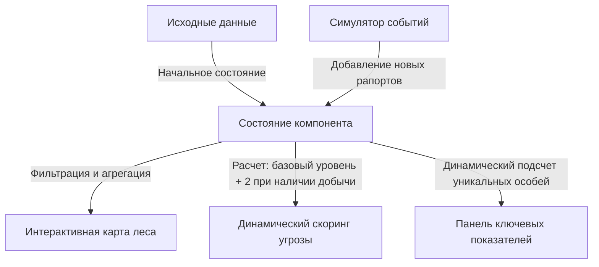

# 🦊 Лисий Диспетчер - интерактивная панель мониторинга

[](https://react.dev)
[](https://tailwindcss.com)
[](https://deepmind.google)

> Связь с Министерством Леса установлена. Терминал слежения активирован. Сегодня на Северной поляне опять неспокойно, рыжие снова таскают добычу. Хорошо, что теперь у меня есть этот дашборд, чтобы отслеживать каждую пушистую аномалию...
> , Лесной Смотритель с позывным Цифровой

---

## 📺 Быстрый обзор, запись экрана

Для экономии времени проверяющего и демонстрации удобства полевого интерфейса я записал короткое видео с разбором основных функций и адаптивности:
👉 **[Ссылка на видео на демонстрационной платформе](https://loom.com/placeholder-demo-video)**

---

## 🔗 Формат сдачи, ссылки

* **Работающая версия, проект на хостинге:** [https://fox-dispatcher-demo.vercel.app](https://fox-dispatcher-demo-vercel-link-placeholder)
* **Журнал разработки:** интерактивный лог создания со всеми принятыми архитектурными решениями встроен непосредственно в интерфейс приложения. Чтобы открыть его, нажмите на кнопку **Журнал разработки** в правом верхнем углу шапки панели.

---

## 🏛️ Архитектура и Продуктовые решения

Вместо реализации стандартной статической таблицы строго по описанию, проект был спроектирован как полноценное интерактивное рабочее место лесничего, оптимизированное для работы в сложных условиях.

### Схема движения данных



### 💡 3 ключевых продуктовых решения:

1. **🗺️ Интерактивная карта леса:**
   Реализована модульная сетка секторов, отображающая число активных контактов. При превышении 2 записей в секторе ячейка на карте автоматически темнеет, создавая эффект тепловой карты. Клик по ячейке фильтрует журнал наблюдений по этой локации, повторный клик сбрасывает фильтр.
2. **🎲 Симулятор аномалий:**
   Кнопка генерации дня моментально добавляет 20 случайных, хронологически отсортированных записей с корректным распределением по всем 6 секторам и случайным статусом добычи. Это позволяет оценить работу показателей и карты на больших объемах данных. Все вычисления кэшируются во избежание снижения производительности.
3. **🧤 Адаптация интерфейса под полевые условия:**
   Смотритель работает в лесу на ходу или в перчатках. Все элементы управления, включая кнопки изменения подозрительности, переключатели добычи и удаления, имеют высоту не менее 44 пикселей. На мобильных экранах любого размера сетка перестраивается в единую колонку, а таблица получает горизонтальную прокрутку, исключая поломку верстки.

---

## 🛠️ Технический стек и особенности разработки

<details>
<summary><b>Развернуть подробности о технологиях и роли нейросетей</b></summary>

### Спецификация стека:
* **Фронтенд-платформа:** библиотека React (сборщик Vite).
* **Стилизация:** фреймворк Tailwind CSS (интеграция через плагин сборщика).
* **Иконки:** библиотека иконок Lucide.
* **Файлы конфигурации и стилей:**
  * Файл логики приложения: [src/App.jsx](file:///c:/Users/PC/.gemini/antigravity/playground/inertial-kilonova/src/App.jsx)
  * CSS-стили и ретро-переменные: [src/index.css](file:///c:/Users/PC/.gemini/antigravity/playground/inertial-kilonova/src/index.css)
  * Конфигурация сборщика: [vite.config.js](file:///c:/Users/PC/.gemini/antigravity/playground/inertial-kilonova/vite.config.js)
  * Входной файл HTML: [index.html](file:///c:/Users/PC/.gemini/antigravity/playground/inertial-kilonova/index.html)

### Процесс разработки с использованием искусственного интеллекта:
* **Роль человека:** я выступал в качестве руководителя продукта и архитектора, формировал логику распределения задач, ставил функциональные требования, проектировал интерфейс и теплокарту, а также исправлял баги.
* **Роль нейросети:** ассистент выполнял задачи старшего разработчика, писал базовый код компонентов, помогал оптимизировать расчеты через кэширование результатов, реализовал алгоритм случайной генерации данных и создал интерфейс по моим детальным инструкциям.
* **Кастомные решения:** для обхода ограничений шрифта, не умеющего корректно отображать заглавную букву «Й», был спроектирован специальный микро-компонент, который накладывает тильду поверх буквы «И», воссоздавая оригинальный вид символа.

</details>

---

## 🚀 Запуск проекта локально

<details>
<summary><b>Развернуть инструкцию по установке</b></summary>

Для локального запуска выполните стандартные шаги:

1. **Клонируйте репозиторий:**
   ```bash
   git clone https://github.com/your-username/fox-dispatcher.git
   cd fox-dispatcher
   ```

2. **Установите зависимости:**
   ```bash
   npm install
   ```

3. **Запустите сервер для разработки:**
   ```bash
   npm run dev
   ```
   Проект будет запущен локально по адресу: `http://127.0.0.1:5173/`

4. **Сборка для продакшена:**
   ```bash
   npm run build
   ```

</details>
