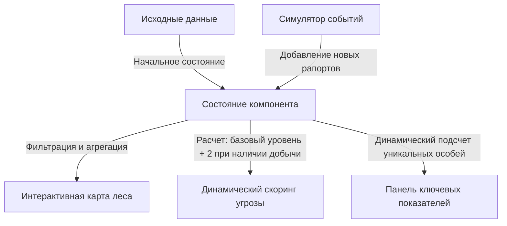

# Лисий Диспетчер - интерактивная панель мониторинга

[](https://react.dev)
[](https://tailwindcss.com)
[](https://deepmind.google)

> Информационная панель мониторинга лесной активности в Секторе 07-Лес. Система предназначена для оперативного контроля перемещения диких животных и оценки уровня угрозы в реальном времени.

---

## Руководство пользователя и онбординг

Панель мониторинга разработана для оперативного контроля и анализа перемещений диких животных. Ниже приведена инструкция по использованию основных интерактивных модулей системы.

### 1. Интерактивная карта секторов
* **Расположение:** Верхняя часть экрана, под ключевыми показателями.
* **Назначение:** Отображение плотности распределения животных по участкам леса.
* **Как пользоваться:** Кликните по любому сектору на карте. Список наблюдений в таблице автоматически отфильтруется по выбранной локации. Повторный клик по тому же сектору или нажатие на кнопку сброса рядом с активным сектором вернет отображение всех записей.
* **Чего ожидать:** Сектора, в которых зафиксировано более двух контактов, автоматически окрашиваются в более темный тон (эффект тепловой карты). Выбранный в данный момент сектор подсвечивается контрастной рамкой.

### 2. Панель показателей и статусов угрозы
* **Расположение:** Блок из трех информационных карточек над картой.
* **Назначение:** Отображение общего числа уникальных особей, суммарного количества рапортов и максимального уровня угрозы в базе.
* **Чего ожидать:** Если расчетный уровень угрозы лисы превышает 9 баллов из 12 возможных, в правой карточке включается красная подсветка и предупреждающий сигнал о необходимости патрулирования.

### 3. Регистрация контактов
* **Расположение:** Кнопка раскрытия формы в панели действий.
* **Назначение:** Добавление новой записи в журнал наблюдений.
* **Как пользоваться:** Нажмите кнопку для открытия формы, заполните параметры (идентификатор лисы, сектор, окрас, наличие добычи, уровень подозрительности и время) и подтвердите запись.
* **Чего ожидать:** Новая строка немедленно добавится в таблицу и автоматически отсортируется по времени события. Все показатели и теплокарта обновятся.

### 4. Изменение параметров в реальном времени
* **Расположение:** Столбцы таблицы «Добыча» и «Базовая подозрительность».
* **Назначение:** Корректировка данных на лету без перезагрузки интерфейса.
* **Как пользоваться:** Клик по кнопке статуса добычи меняет значение (с добычей / без добычи). Кнопки плюс и минус меняют оценку подозрительности животного от 1 до 10.
* **Чего ожидать:** Формула автоматически рассчитывает реальную угрозу (базовое значение плюс 2 при наличии добычи). При изменении значений шкала угрозы в таблице, показатели на дашборде и тепловая карта пересчитываются мгновенно. Строки с критической угрозой более 9 выделяются красным цветом.

### 5. Удаление записей и отмена действий
* **Расположение:** Правый столбец таблицы.
* **Назначение:** Очистка журнала от неверных записей с защитой от случайных кликов.
* **Как пользоваться:** Нажмите на иконку корзины в строке наблюдения для удаления.
* **Чего ожидать:** Строка исчезает из таблицы. Вверху страницы появляется информационная панель с кнопкой отмены. Нажатие на нее восстанавливает удаленное наблюдение в журнале.

### 6. Симуляция данных и сброс состояния
* **Расположение:** Панель действий под картой секторов.
* **Назначение:** Наполнение базы событиями для тестирования производительности и возврат к демо-данным.
* **Как пользоваться:** Кнопка «Сгенерировать день» добавляет 20 случайных записей. Кнопка «Сбросить данные» очищает локальное кэширование браузера и возвращает дашборд к исходным 3 записям из технического задания.
* **Чего ожидать:** После сброса в углу экрана отображается всплывающее уведомление, подтверждающее очистку.

### 7. Экспорт отчетов
* **Расположение:** Правая часть заголовка таблицы наблюдений.
* **Назначение:** Сохранение данных для отчетности в текстовый файл.
* **Как пользоваться:** Нажмите кнопку выгрузки отчета.
* **Чего ожидать:** На устройство скачивается структурированный текстовый файл с текущим набором отфильтрованных данных и сводной аналитикой.

---


## Формат сдачи, ссылки

* **Работающая версия, проект на хостинге:** [https://fox-dispatcher-demo.vercel.app](https://fox-dispatcher-demo-vercel-link-placeholder)
* **Журнал разработки:** интерактивный лог создания со всеми принятыми архитектурными решениями встроен непосредственно в интерфейс приложения. Чтобы открыть его, нажмите на кнопку **Журнал разработки** в правом верхнем углу шапки панели.

---

## Архитектура и Продуктовые решения

Вместо реализации стандартной статической таблицы строго по описанию, проект был спроектирован как полноценное интерактивное рабочее место лесничего, оптимизированное для работы в сложных условиях.

### Схема движения данных



### 3 ключевых продуктовых решения:

1. **Интерактивная карта леса:**
   Реализована модульная сетка секторов, отображающая число активных контактов. При превышении 2 записей в секторе ячейка на карте автоматически темнеет, создавая эффект тепловой карты. Клик по ячейке фильтрует журнал наблюдений по этой локации, повторный клик сбрасывает фильтр.
2. **Симулятор аномалий:**
   Кнопка генерации дня моментально добавляет 20 случайных, хронологически отсортированных записей с корректным распределением по всем 6 секторам и случайным статусом добычи. Это позволяет оценить работу показателей и карты на больших объемах данных. Все вычисления кэшируются во избежание снижения производительности.
3. **Адаптация интерфейса под полевые условия:**
   Смотритель работает в лесу на ходу или в перчатках. Все элементы управления, включая кнопки изменения подозрительности, переключатели добычи и удаления, имеют высоту не менее 44 пикселей. На мобильных экранах любого размера сетка перестраивается в единую колонку, а таблица получает горизонтальную прокрутку, исключая поломку верстки.

---

## Технический стек и особенности разработки

<details>
<summary><b>Развернуть подробности о технологиях и роли нейросетей</b></summary>

### Спецификация стека:
* **Фронтенд-платформа:** библиотека React (сборщик Vite).
* **Стилизация:** фреймворк Tailwind CSS (интеграция через плагин сборщика).
* **Иконки:** библиотека иконок Lucide.
* **Файлы конфигурации и стилей:**
  * Файл логики приложения: [src/App.jsx](file:///c:/Users/PC/.gemini/antigravity/playground/inertial-kilonova/src/App.jsx)
  * CSS-стили и ретро-переменные: [src/index.css](file:///c:/Users/PC/.gemini/antigravity/playground/inertial-kilonova/src/index.css)
  * Конфигурация сборщика: [vite.config.js](file:///c:/Users/PC/.gemini/antigravity/playground/inertial-kilonova/vite.config.js)
  * Входной файл HTML: [index.html](file:///c:/Users/PC/.gemini/antigravity/playground/inertial-kilonova/index.html)

### Процесс разработки с использованием искусственного интеллекта:
* **Роль человека:** я выступал в качестве руководителя продукта и архитектора, формировал логику распределения задач, ставил функциональные требования, проектировал интерфейс и теплокарту, а также исправлял баги.
* **Роль нейросети:** ассистент выполнял задачи старшего разработчика, писал базовый код компонентов, помогал оптимизировать расчеты через кэширование результатов, реализовал алгоритм случайной генерации данных и создал интерфейс по моим детальным инструкциям.
* **Кастомные решения:** для обхода ограничений шрифта, не умеющего корректно отображать заглавную букву «Й», был спроектирован специальный микро-компонент, который накладывает тильду поверх буквы «И», воссоздавая оригинальный вид символа.

</details>

---

## Запуск проекта локально

<details>
<summary><b>Развернуть инструкцию по установке</b></summary>

Для локального запуска выполните стандартные шаги:

1. **Клонируйте репозиторий:**
   ```bash
   git clone https://github.com/your-username/fox-dispatcher.git
   cd fox-dispatcher
   ```

2. **Установите зависимости:**
   ```bash
   npm install
   ```

3. **Запустите сервер для разработки:**
   ```bash
   npm run dev
   ```
   Проект будет запущен локально по адресу: `http://127.0.0.1:5173/`

4. **Сборка для продакшена:**
   ```bash
   npm run build
   ```

</details>
